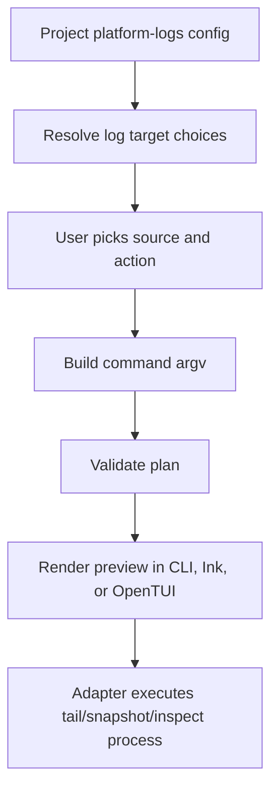

# @gg-utils/platform-logs-kit

Config-driven platform log UI and command-planning helpers.

This kit composes `@gg-utils/platform-logs-core` primitives into reusable log target resolution,
argv construction, command previews, history/snapshot helpers, line inspection, plan validation,
classic interactive menus, and Ink/OpenTUI wizard models.

## Install

```bash
npm install @gg-utils/platform-logs-kit@git+https://github.com/gg-utils/platform-logs-kit.git#main
```

Pinned dependency example:

```json
{
  "dependencies": {
    "@gg-utils/platform-logs-kit": "git+https://github.com/gg-utils/platform-logs-kit.git#434860e"
  }
}
```

## When To Use

- You have explicit project log source config and need reusable UI command planning.
- You need to build `tail`, snapshot, or inspect command argv from selected log targets.
- You need an Ink/OpenTUI/classic menu shell for log selection.
- You need plain command previews without spawning processes.

Skip this package when you only need file discovery or `tail` primitives; use
`@gg-utils/platform-logs-core`.

## Public Surfaces

| Import | Purpose |
|---|---|
| `@gg-utils/platform-logs-kit/resolve-log-targets` | Config-driven log target resolution. |
| `@gg-utils/platform-logs-kit/build-argv` | Tail/snapshot/inspect argv construction. |
| `@gg-utils/platform-logs-kit/format-command` | Shell command preview formatting. |
| `@gg-utils/platform-logs-kit/validate-plan` | Log action plan validation. |
| `@gg-utils/platform-logs-kit/wizard-model` | Reusable wizard state/model helpers. |
| `@gg-utils/platform-logs-kit/ink-app` | Reusable Ink log UI. |
| `@gg-utils/platform-logs-kit/opentui-app` | Reusable OpenTUI log UI. |
| `@gg-utils/platform-logs-kit/ui-launcher` | UI launcher argv and spawn helpers. |

## Quick Start

```ts
import {
  type PlatformLogsKit_Config,
  logTailUiDefaultViewPlan,
  logTailUiResolveRepoRootFromModuleUrl,
  logTailUiValidateViewPlan,
} from "@gg-utils/platform-logs-kit";

declare const config: PlatformLogsKit_Config;

const repoRoot = logTailUiResolveRepoRootFromModuleUrl({
  moduleUrl: import.meta.url,
  relativePathFromModuleDir: "../..",
});

const plan = logTailUiDefaultViewPlan(config);
const validationErrors = logTailUiValidateViewPlan(config, plan);
console.log({ repoRoot, ok: validationErrors.length === 0 });
```

## Operational Flow



## Development

```bash
git clone https://github.com/gg-utils/platform-logs-kit.git
cd platform-logs-kit
npm run type-check
npm test
npm run build
```

Scripts currently expect the source-first workspace toolchain.

## Layout

```text
.
|-- src/resolve-log-targets.ts
|-- src/build-argv.ts
|-- src/format-command.ts
|-- src/wizard-model.ts
|-- src/ink-app.tsx
|-- src/opentui-app.tsx
|-- dist/
`-- package.json
```

## Caveats

- Project-specific log directories, source IDs, npm aliases, and operator labels belong in config.
- The kit builds plans and UI state; adapters perform process execution.
- The package depends on `@gg-utils/platform-logs-core`.
